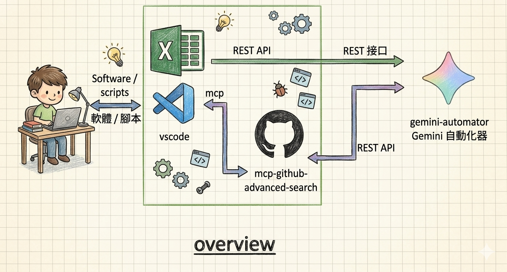

# Gemini Automator

The missing Gemini API interface.

Automates Google Gemini interactions via Playwright running inside a Docker container.
The server receives questions via HTTP and uses a headless Chrome to query `gemini.google.com`.

## Architecture

```bash
source/server/                           # Express.js server (endpoints: /ask_gemini, /thinking_mode)
source/stub/                             # Test clients (run from host machine)
docker/                                  # Docker Compose config
docker/images/jenkins_docker_chromium/   # Docker image (Ubuntu + Chrome + Node.js 20)
```

## Prerequisites

- Docker with external networks `common_network`
- Container IP: `192.168.xx.yy`

## Quick Start

### 1. Start the container

```bash
cd docker
docker compose -f _main.yml up -d gemini_agent_1
docker compose -f _main.yml logs -f
```

### 2. Run the server (inside container)

```bash
docker exec -it gemini_agent_1 bash
cd /app
npm run start
```

Or with auto-reload (on host, after mounting source):

```bash
cd source/server
npx nodemon --exec "node ./server.js"
```

### 3. Send a request (from host)

```bash
node source/stub/009_test_thinking_mode.js
```

## API Endpoints

### GET /thinking_mode

Returns available thinking modes.

```bash
curl http://192.168.11.41:3000/thinking_mode
# Response: ["Fast", "Thinking"]
```

### POST /ask_gemini

Ask a question to Gemini.

```bash
curl -X POST http://192.168.11.41:3000/ask_gemini \
  -H "Content-Type: application/json" \
  -d '{"thinking_mode": "Fast", "question": "Hi, how are you?"}'
```

## Configuration

Key environment variables (set in `docker/gemini_agent_1.yml`):

| Variable              | Default | Description          |
| --------------------- | ------- | -------------------- |
| `BROWSER_HEADED_MODE` | 1       | 1=headed, 0=headless |
| `CUSTOM_PORT`         | 3000    | Internal HTTP port   |
| `CHROME_CLI`          | —       | URL to open on start |

Browser and profile settings are in `source/server/profile_setup.js`.

## Development

Test stubs are in `source/stub/` and call the server at `http://192.168.11.41:3000`.

## Image Build (if needed)

```bash
cd docker/images/jenkins_docker_chromium
docker build -t jenkins_docker_chromium .
```

## TODO (by ai)

- [ ] Add CSRF token handling for `/ask_gemini` and `/thinking_mode` endpoints
- [ ] Add API key or token-based authentication
- [ ] Move hardcoded profile settings (`profile_setup.js`) to environment variables
- [ ] Fix `BROWSER_HEADED_MODE` logic in `initBrowser.js` (currently inverted — `=== '0'` triggers headed mode)
- [ ] Change `headless: false` to `headless: !BROWSER_HEADED_MODE` in `initBrowser.js` line 24
- [ ] Add input validation and rate limiting on `/ask_gemini`
- [ ] Document or create external Docker networks (`common_network`, `commont_network1`) in setup instructions
- [ ] Consider request timeout handling (currently 180s hardcoded)
- [ ] Add logging levels (currently `console.log` everywhere)
